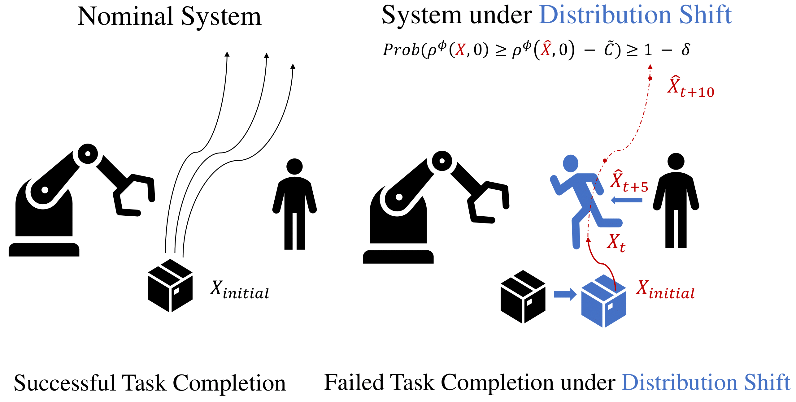

# Robust Conformal Prediction for STL Runtime Verification under Distribution Shift

## Introduction
In this project, we demonstrate the STL runtime verification algorithms from the paper, Robust Conformal Prediction for STL Runtime Verification under Distribution Shift, on both the running example (F-16 Verification Benchmark) and the Case Study (Franka Manipulator Robot). The paper can be found [here](https://arxiv.org/abs/2311.09482). Below is the abstract of the paper:

Cyber-physical systems (CPS) designed in simulators behave differently in the real-world. Once they are deployed in the real-world, we would hence like to predict system failures during runtime. We propose robust predictive runtime verification (RPRV) algorithms under signal temporal logic (STL) tasks for general stochastic CPS. The RPRV problem faces several challenges: (1) there may not be sufficient data of the behavior of the deployed CPS, (2) predictive models are based on a distribution over system trajectories encountered during the design phase, i.e., there may be a distribution shift during deployment. To address these challenges, we assume to know an upper bound on the statistical distance (in terms of an f-divergence) between the distributions at deployment and design time, and we utilize techniques based on robust conformal prediction. Motivated by our results in [1], we construct an accurate and an interpretable RPRV algorithm. We use a trajectory prediction model to estimate the system behavior at runtime and robust conformal prediction to obtain probabilistic guarantees by accounting for distribution shifts. We precisely quantify the relationship between calibration data, desired confidence, and permissible distribution shift. To the best of our knowledge, these are the first statistically valid algorithms under distribution shift in this setting. We empirically validate our algorithms on a Franka manipulator within the NVIDIA Isaac sim environment.

<table cellpadding="0" cellspacing="0" border="0" width="100%">
<tr><td align="center">

</td></tr>
</table>

## Instruction

### F-16 Verification Benchmark
The codes associated with the F-16 Verifcation Benchmark can be found in the folder **F-16_Benchmark**. To generate the plots, simply run **demo.py**. The vanilla runtime verification algorithms and their robust counterparts are provided in **algorithms.py** (Please note that we refer to the indirect method variant I as the indirect method and the indirect method variant II as the hybrid method in our codes). Please note that for both the running example and the case study, the estimated distribution shift can be different from what we have in the paper due to the indeterminism of the epsilon estimation algorithms, but in all cases we provide valid statistical guarantee.

### Franka Manipulator
The codes associated with the Case Study: Franka Manipulator can be found in the folder **Franka_Manipulator**. To run the direct methods, simply run **demo.py**. To run the indirect methods, run **demo_downsampled.py**. Please notice that since we are comparing our proposed indirect methods with the indirect method from [1], we add a suffix **new** to the functions for our methods proposed in the paper. Again, we refer to the indirect method variant I as the indirect method and the indirect method variant II as the hybrid method in our codes.

We provide the data from Isaac Sim in **Data**. However, you can optionally run the codes from **Codes_for_data_collection** in the Isaac Sim environment to collect data on your own. To collect trajectories, follow the instructions [here](https://docs.omniverse.nvidia.com/isaacsim/latest/core_api_tutorials/tutorial_core_hello_world.html), and replace **__init__.py**, **hello_world.py**, and **hello_world_extension.py** with the files we provide.

## Contact Information
[Yiqi (Nick) Zhao](https://zhaoy37.github.io/) is a PhD Student for Computer Science at the University of Southern California. For any questions or suggestions, please feel free to contact us at yiqizhao@usc.edu.
